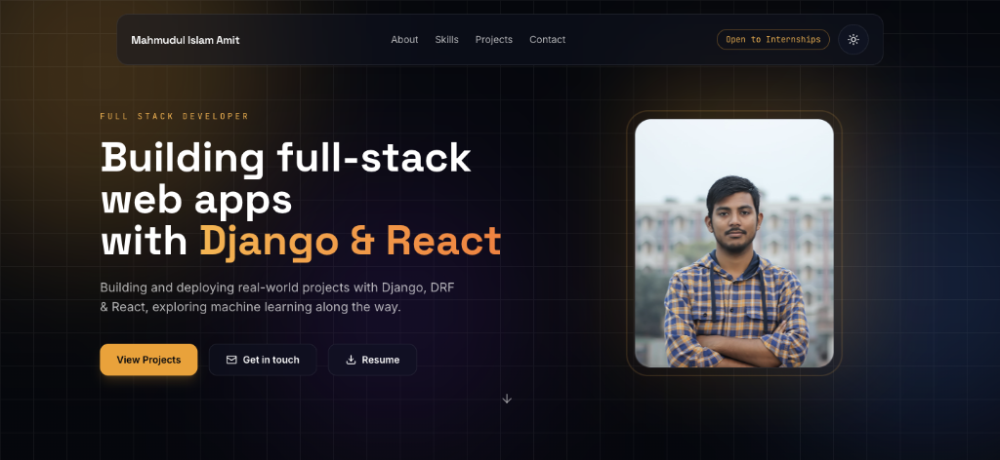
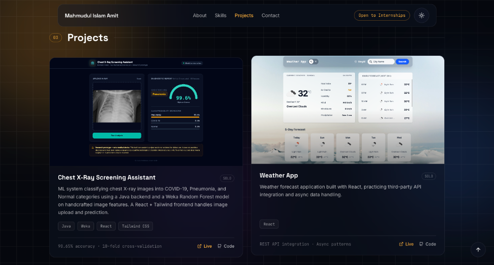

# Md. Mahmudul Islam Amit — Portfolio

> Personal portfolio website showcasing my skills, projects, experience, education, and interests in software engineering.

## 🚀 Live Demo
Live Demo: https://mahmudul-islam-portfolio.vercel.app

## 📖 About the project
This is a modern, fully responsive personal portfolio designed to highlight my journey as a full-stack developer. Built with Vite, React, and Tailwind CSS, it features a glassmorphism UI, dark mode aesthetics, and smooth scroll-reveal animations. It also includes a fully functional contact form powered by a Vercel Serverless Function and the Resend email API.

## ✨ Features
* 📱 **Responsive Design:** Optimized for mobile, tablet, and desktop devices.
* 🎨 **Modern UI:** Cinematic dark background with glassmorphism elements and smooth scroll animations.
* 🎓 **About & Education:** Details about my background, learning journey, and academic milestones.
* 🛠️ **Skills:** Categorized display of frontend, backend, and tools I use.
* 💼 **Featured Projects:** Interactive project cards with tech stacks, live/code links, and hover-to-play GIF demos.
* ✉️ **Working Contact Form:** Secure serverless email integration to reach me directly.

## 💻 Tech Stack
* 🌐 **Frontend:** React, JavaScript, HTML, CSS
* 💅 **Styling:** Tailwind CSS
* ⚡ **Build Tool:** Vite
* ⚙️ **Backend/API:** Vercel Serverless Functions, Resend API (for emails)
* ☁️ **Deployment:** Vercel
* 🗄️ **Version Control:** Git, GitHub

## 📸 Screenshots

### Home


### Projects


## ⚙️ Installation / Run locally

To run this project on your local machine, follow these steps:

```bash
# Clone the repository
git clone https://github.com/mahmudul58/mahmudul-portfolio.git

# Navigate to the project directory
cd mahmudul-portfolio

# Install dependencies
npm install

# Run the development server
npm run dev
```

## 📁 Project Structure

```text
mahmudul-portfolio/
│
├── api/
│   └── contact.js       # Vercel serverless function for emails
├── public/
│   └── gifs/            # Project demo GIFs and poster images
├── src/
│   ├── components/      # Reusable UI components (Navbar, Hero, etc.)
│   ├── context/         # React Context (e.g., Theme state)
│   ├── data/            # Static content (profile, skills, projects)
│   ├── hooks/           # Custom React hooks
│   ├── App.jsx          # Main application layout
│   └── main.jsx         # React entry point
├── .env.example         # Environment variables template
├── .gitignore
├── package.json
├── tailwind.config.js   # Tailwind styling configuration
└── vite.config.js       # Vite build configuration
```

## 🔐 Environment Variables

This project uses an API to send emails from the contact form. To run the contact form locally, create a `.env` file based on the example:

```bash
cp .env.example .env
```

Add your Resend API key inside `.env`:
```text
RESEND_API_KEY=your_resend_api_key_here
```
**Important:** Never commit your actual `.env` file to version control. It is already added to `.gitignore`.

## 🤝 Author

**Md. Mahmudul Islam Amit**
* **GitHub:** [mahmudul58](https://github.com/mahmudul58)
* **LinkedIn:** [mahmudul-islam-amit](https://linkedin.com/in/mahmudul-islam-amit)
* **Email:** mahmudul.mbstu.ict@gmail.com
